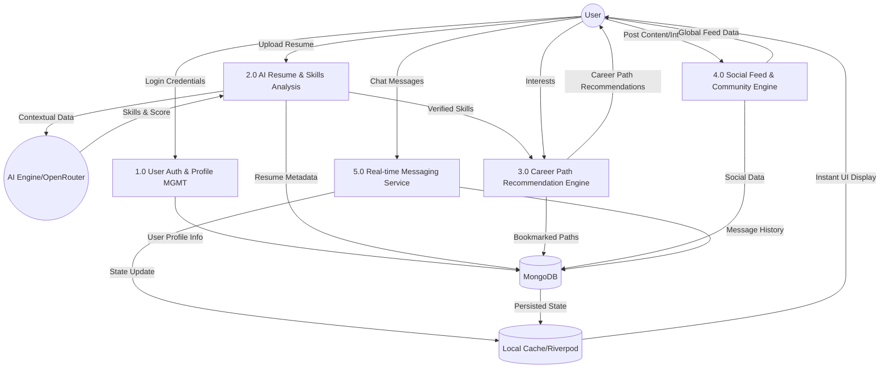

# Career Path Advisor: System Diagrams

This document providing a high-level overview of the application's logic and data structures through UML and Data Flow diagrams.

## 1. Activity Diagram (User Workflow)

The following diagram illustrates the primary user journey, from initial profile setup to AI-driven career guidance and professional networking.

```mermaid
activityDiagram
    start
    :User Opens App;
    if (Is Logged In?) then (No)
        :Navigate to Register/Login;
        :User Authentication;
    else (Yes)
        :Navigate to Dashboard;
    end
    
    partition "Career Preparation" {
        :Upload Resume;
        :AI Analysis (Gemini via OpenRouter);
        :Generate Skills Profile;
    }
    
    partition "Discovery & Goal Setting" {
        :Request Career Suggestions;
        :View Recommended Career Paths;
        if (Interest in Path?) then (Yes)
            :Save/Bookmark Career Path;
            :Track Progress to Goal;
        else (No)
            :Refine Search / Retake Skills Assessment;
        end
    }
    
    partition "Professional Networking" {
        fork
            :Explore Social Feed;
            :Create Professional Posts;
        fork again
            :Search for Members;
            :Send Connection Request;
        end fork
        
        :Establish Connection;
        :Engage in Real-time Chat;
    }
    
    :Monitor Growth via Dashboard;
    stop
```

---

## 2. Data Flow Diagram (DFD) - Level 1

The DFD illustrates how data moves between the User, the System Modules, and the External AI/Database layers.

### DFD Components:
- **External Entities:** User, AI Engine (OpenRouter/Gemini).
- **Processes:** Auth, Resume Analysis, Career Engine, Social/Community, Messaging.
- **Data Stores:** MongoDB (User, Posts, Careers), Local Cache (Provider State).



---

## 3. Component Architecture

> [!NOTE]
> The system follows a **Decoupled Architecture**:
> - **Frontend (Flutter):** Uses Riverpod for state management and caching.
> - **Backend (Spring Boot):** Acts as the orchestrator for business logic and AI integration.
> - **Database (MongoDB):** Provides Flexible schema for diverse career and social data.
> - **Integration Layer:** Uses OpenRouter to unify access to advanced LLMs like Gemini 2.0 Flash.
